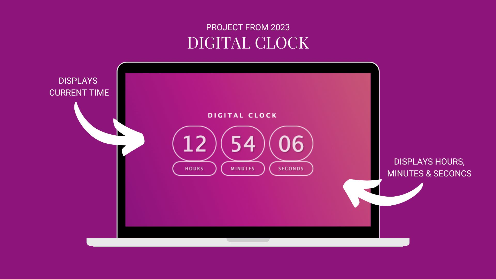

# DIGITAL CLOCK

The 'Digital Clock' App displays the current time.

## Preview



## Link

Visit the Digital Clock
[digital-clock](https://lucent-cobbler-44743f.netlify.app/)

## Code Snippet

```JavaScript
# function updateClock() {
  let h = new Date().getHours();
  let m = new Date().getMinutes();
  let s = new Date().getSeconds();
  let ms = new Date().get;

  h = h < 10 ? "0" + h : h;
  m = m < 10 ? "0" + m : m;
  s = s < 10 ? "0" + s : s;

  hourEl.innerText = h;
  minuteEl.innerText = m;
  secondEl.innerText = s;
  setTimeout(() => {
    updateClock();
  }, 1000);
}
```

## Author

- Vanessa Krämer
  - Aspiring Frontend Developer
  - Developer Akademie Student
